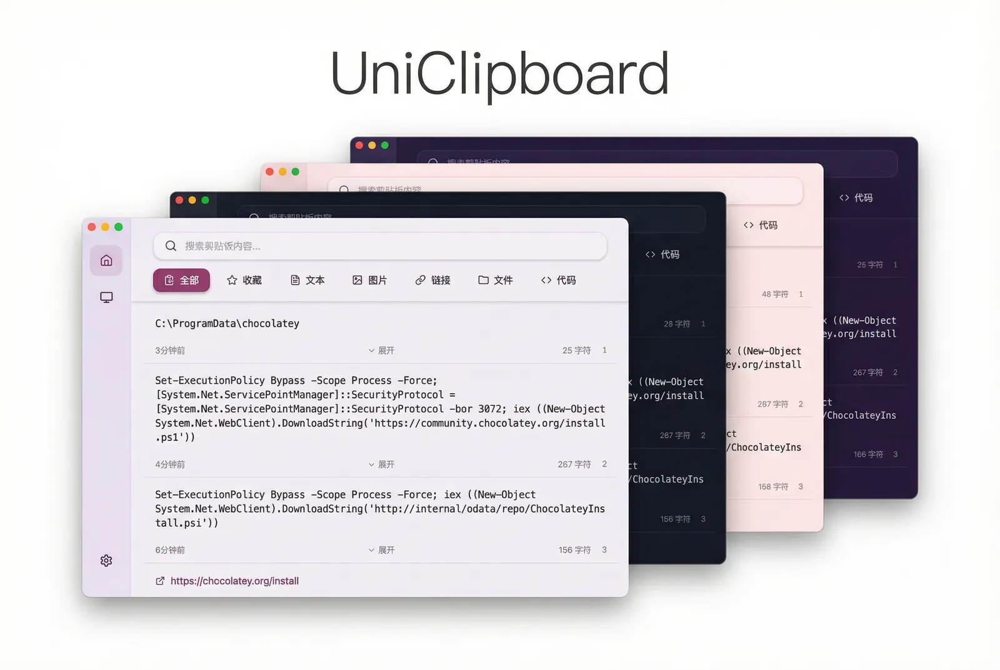

<div align="center">
  <br/>

  <a href="https://github.com/mkdir700/uniclipboard-desktop/releases">
    
  </a>
  <a href="https://github.com/mkdir700/uniclipboard-desktop/releases">
    
  </a >
  <a href="https://github.com/mkdir700/uniclipboard-desktop/releases">
    
  </a>

  <div>
    <a href="./LICENSE">
      
    </a >
    <a href="https://github.com/mkdir700/uniclipboard-desktop/releases">
      
    </a >
    <a href="https://codecov.io/gh/UniClipboard/UniClipboard" >
      
    </a>
  </div>

</div>

> [!WARNING]
> UniClipboard is currently under active development and may have unstable or missing features. Feel free to try it out and provide feedback!

English | [简体中文](./README.md)

## Project Overview

UniClipboard is a clipboard synchronization tool designed to provide a seamless clipboard sharing experience, allowing you to instantly share text, images, and files across different devices.



## Features

- **Cross-platform support**: Supports Windows, macOS, and Linux operating systems
- **Real-time sync**: Instantly share clipboard content between connected devices
- **Rich content types**: Supports text, images, files, and more
- **Secure encryption**: Uses XChaCha20-Poly1305 AEAD encryption algorithm to ensure secure data transmission
- **Multi-device management**: Easily add and manage multiple devices
- **Flexible configuration**: Provides extensive customization options

## Installation

### Download from Releases

Visit the [GitHub Releases](https://github.com/mkdir700/uniclipboard-desktop/releases) page to download the installation package for your operating system.

### Build from Source

```bash
# Clone the repository
git clone https://github.com/mkdir700/uniclipboard-desktop.git
cd uniclipboard-desktop

# Install dependencies
bun install

# Start development mode
bun tauri dev

# Build application
bun tauri build
```

## Usage

1. **First launch**: Start the application and complete basic setup to create your device identity
2. **Add devices**: Click "Add Device" button on the "Devices" page to add new devices
3. **Clipboard sync**: Copied content will automatically sync to all connected devices
4. **Settings**: Customize application behavior, network, and security options on the "Settings" page

### Main Pages

- **Dashboard**: Overview of current clipboard status and device connections
- **Devices**: Manage and pair devices, set device access permissions
- **Settings**: Configure application parameters, including general settings, sync options, security & privacy, network settings, and storage management

## Advanced Features

### Network Configuration

Supports multiple network connection modes that can be configured based on your network environment:

- **LAN sync**: Uses local area network direct sync by default
- **WebDAV sync**: Under development

### Security Features

- **End-to-end encryption**: All data transmitted between devices is encrypted
- **XChaCha20-Poly1305 encryption**: Modern AEAD cipher providing authenticated encryption
  - 24-byte random nonce effectively reduces nonce reuse risks
  - 32-byte (256-bit) encryption key
  - Provides ciphertext integrity and authenticity verification
- **Argon2id key derivation**: Securely derives encryption keys from user passphrase
  - Memory cost: 128 MB
  - Iterations: 3
  - Parallelism: 4 threads
  - Resistant to GPU/ASIC cracking attacks
- **Key management**: Layered key architecture protects data
  - MasterKey for clipboard content encryption
  - Key Encryption Key (KEK) derived from passphrase via Argon2id
  - KEK securely stored in system keyring (macOS Keychain, Windows Credential Manager, Linux Secret Service)
  - MasterKey encrypted and stored in KeySlot file
- **Device authorization**: Precise control over each device's access permissions

## Contributing

Contributions of all kinds are welcome! If you're interested in improving UniClipboard:

1. Fork this repository
2. Create your feature branch (`git checkout -b feature/amazing-feature`)
3. Commit your changes (`git commit -m 'Add some amazing feature'`)
4. Push to the branch (`git push origin feature/amazing-feature`)
5. Create a Pull Request

## License

This project is licensed under the Apache-2.0 License - see the [LICENSE](./LICENSE) file for details.

## Acknowledgments

- [Tauri](https://tauri.app) - Cross-platform application framework
- [React](https://react.dev) - Frontend UI development framework
- [Rust](https://www.rust-lang.org) - Safe and efficient backend implementation language

---

**Have questions or suggestions?** [Create an Issue](https://github.com/mkdir700/uniclipboard-desktop/issues/new) or contact us to discuss!
