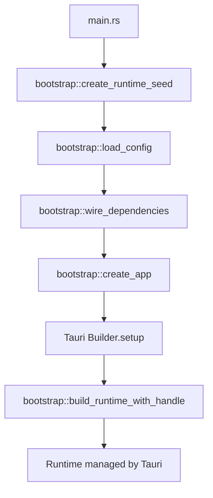

# Bootstrap System

The **Bootstrap module** is the "wiring operator" that assembles all infrastructure and platform implementations into the application layer. It is the **only place** in the codebase allowed to depend on all implementation layers simultaneously.

## Core Principles

> **Bootstrap is a "wiring operator", not a "decision maker".**
>
> It must stand outside all layers, or the architecture will slowly collapse.

> **Bootstrap is the only place allowed to depend on all implementation layers.**
>
> It may not use all implementations, but only here is it architecturally legal to simultaneously depend on `uc-infra` + `uc-platform` + `uc-app`.

## What Bootstrap Does

Bootstrap has three responsibilities:

1. **Load Configuration** - Read TOML config, return pure DTO
2. **Create Implementations** - Instantiate all infra/platform adapters
3. **Wire Dependencies** - Inject implementations into App

### What Bootstrap Does NOT Do

- ❌ Business logic or validation
- ❌ Configuration policy decisions
- ❌ State checking (e.g., "is vault initialized?")
- ❌ Logging business warnings

## Module Structure

```
uc-tauri/src/bootstrap/
├── mod.rs              # Module exports
├── config.rs           # Load TOML into pure DTO
├── wiring.rs           # Create implementations and wire them
├── runtime.rs          # AppRuntime creation and lifecycle
└── seed.rs             # RuntimeSeed (pre-Tauri setup state)
```

### File Responsibilities

| File         | Responsibilities                                     | May Depend On                            | Prohibited                                                    |
| ------------ | ---------------------------------------------------- | ---------------------------------------- | ------------------------------------------------------------- |
| `config.rs`  | Load TOML, device_name, vault paths (facts only)     | `uc-core::config` (DTO only)             | ❌ Check vault state, ❌ Business validation, ❌ Log warnings |
| `wiring.rs`  | Create infra/platform implementations, construct App | `uc-infra`, `uc-platform`, `uc-app::App` | ❌ Any business logic                                         |
| `runtime.rs` | Create AppRuntime, manage lifecycle                  | `uc-app::App`, `uc-platform`             | ❌ Direct concrete implementation dependency                  |
| `seed.rs`    | Define RuntimeSeed struct                            | None                                     | ❌ Any dependencies                                           |
| `mod.rs`     | Export entry functions                               | All internal modules                     | ❌ Depend on concrete implementations                         |

## Configuration Loading (config.rs)

### The Iron Rule

> **config.rs may "discover" vault presence, but must not "care" about it.**

### What's Allowed

✅ **Read TOML files**
✅ **Parse into AppConfig DTO**
✅ **Read path info** (without checking file existence)
✅ **Return IO/Parse errors**

### What's Prohibited

❌ **Check if vault files exist** - State checking is a business decision
❌ **Throw business errors** - Only IO/parse errors allowed
❌ **Log warnings to user** - e.g., "vault does not exist"
❌ **Set default values** - Empty string is a valid "fact"

### Example Implementation

```rust
// uc-tauri/src/bootstrap/config.rs
use uc_core::config::AppConfig;

pub fn load_config() -> Result<AppConfig, ConfigError> {
    let config_path = get_config_path()?;

    // ✅ ALLOWED: Read TOML
    let content = std::fs::read_to_string(&config_path)?;

    // ✅ ALLOWED: Parse into DTO (no validation)
    let config = AppConfig::from_toml(&content)?;

    // ✅ ALLOWED: Return pure DTO
    Ok(config)
}

pub enum ConfigError {
    Io(std::io::Error),
    Parse(toml::de::Error),
    // ❌ WRONG: Missing(String) - "missing" is a decision, not a fact
}
```

### Why No Validation?

**Wrong approach** (policy in config):

```rust
// ❌ WRONG: Config makes policy decisions
pub fn load_config() -> Result<AppConfig, ConfigError> {
    let config = AppConfig::from_toml(&content)?;

    if config.vault_path.is_empty() {
        warn!("Vault path not configured, using default");
        config.vault_path = get_default_vault_path();  // Policy!
    }

    if !std::path::Path::new(&config.vault_path).exists() {
        return Err(ConfigError::MissingVault);  // Business error!
    }

    Ok(config)
}
```

**Correct approach** (facts only):

```rust
// ✅ CORRECT: Config returns facts, use case decides policy
pub fn load_config() -> Result<AppConfig, ConfigError> {
    let config = AppConfig::from_toml(&content)?;
    Ok(config)  // Even if vault_path is empty, that's a fact
}

// Policy in use case:
impl InitializeAppUseCase {
    pub fn execute(&self, config: AppConfig) -> Result<(), UseCaseError> {
        if config.vault_path.is_empty() {
            // Business decision: show onboarding
            return Err(UseCaseError::OnboardingRequired);
        }
        // ...
    }
}
```

## Dependency Wiring (wiring.rs)

### Purpose

Create all infrastructure and platform implementations, then inject them into `App`.

### Example Implementation

```rust
// uc-tauri/src/bootstrap/wiring.rs
use uc_core::ports::*;
use uc_infra::db::{SqliteClipboardRepository, SqliteDeviceRepository};
use uc_platform::{MacOSClipboard, Libp2pNetwork};
use uc_app::App;

pub struct AppDeps {
    pub clipboard_repo: Arc<dyn ClipboardRepositoryPort>,
    pub device_repo: Arc<dyn DeviceRepositoryPort>,
    pub clipboard: Arc<dyn ClipboardPort>,
    pub network: Arc<dyn NetworkPort>,
    // ... all other ports
}

pub fn wire_dependencies(config: &AppConfig) -> Result<AppDeps, WiringError> {
    // ✅ ALLOWED: Create infrastructure implementations
    let db_pool = create_db_pool(&config.database_path)?;
    let clipboard_repo = Arc::new(SqliteClipboardRepository::new(db_pool.clone()));
    let device_repo = Arc::new(SqliteDeviceRepository::new(db_pool));

    // ✅ ALLOWED: Create platform implementations
    let clipboard = Arc::new(MacOSClipboard::new()?);
    let network = Arc::new(Libp2pNetwork::new(&config.network)?);

    // ✅ ALLOWED: Wire into AppDeps
    Ok(AppDeps {
        clipboard_repo,
        device_repo,
        clipboard,
        network,
    })
}

pub enum WiringError {
    DatabaseInit(String),
    NetworkInit(String),
    ClipboardInit(String),
}
```

### What's Prohibited in wiring.rs

❌ **Business logic** - Don't decide "what to do if encryption uninitialized"
❌ **Configuration validation** - Config already loaded, use it as-is
❌ **Direct implementation usage** - Must inject through Port traits

**Example of wrong approach**:

```rust
// ❌ WRONG: wiring.rs contains business logic
pub fn wire_dependencies(config: &AppConfig) -> Result<AppDeps, WiringError> {
    let encryption = Arc::new(SqliteEncryptionRepository::new(db_pool));

    // Business logic: checking if encryption initialized
    if !encryption.is_initialized()? {
        warn!("Encryption not initialized, creating new keys");
        encryption.initialize()?;
    }

    // ... wrong! This belongs in a use case
}
```

## App Construction

### Direct Construction Pattern

UniClipboard **does not use Builder pattern** for App construction. Instead, we use direct construction with `AppDeps`:

```rust
// uc-app/src/lib.rs
pub struct AppDeps {
    pub clipboard_repo: Arc<dyn ClipboardRepositoryPort>,
    pub encryption: Arc<dyn EncryptionPort>,
    pub device_repo: Arc<dyn DeviceRepositoryPort>,
    pub network: Arc<dyn NetworkPort>,
    // ... all other ports
}

impl App {
    /// Constructor signature is the dependency manifest
    pub fn new(deps: AppDeps) -> Self {
        // Store dependencies
        Self { deps }
    }
}

// uc-tauri/src/bootstrap/wiring.rs
let app = App::new(AppDeps {
    clipboard_repo,
    encryption,
    device_repo,
    network,
});
```

### Why Not Builder Pattern?

**Builder Problem** in hexagonal architecture:

```rust
// ❌ WRONG: AppBuilder in uc-app violates layer boundary
// uc-app/src/builder.rs
impl AppBuilder {
    pub fn new() -> Self { /* ... */ }

    pub fn with_clipboard_repo(mut self, repo: SqliteClipboardRepository) -> Self {
        // ^ Concrete type! App layer shouldn't know about implementations
        self.clipboard_repo = repo;
        self
    }
}
```

**Correct approach**: Direct construction

```rust
// ✅ CORRECT: Direct construction with trait objects
pub fn new(deps: AppDeps) -> Self
```

**Benefits**:

- Constructor signature = complete dependency manifest
- No hidden logic or default values
- Clear at call site what dependencies are required
- Enforced by Rust compiler

## Error Handling

### Error Layering

Bootstrap has its own error type for infrastructure initialization:

```rust
pub enum WiringError {
    DatabaseInit(String),
    NetworkInit(String),
    ClipboardInit(String),
    EncryptionInit(String),
}
```

### Error Handling Strategy

| Error Type     | Location  | Default Handling                 | Notes                                |
| -------------- | --------- | -------------------------------- | ------------------------------------ |
| `ConfigError`  | config.rs | Recoverable (use defaults)       | IO/parse errors only                 |
| `WiringError`  | wiring.rs | Default fatal                    | Can be decided based on runtime mode |
| `UseCaseError` | uc-app    | Convert to user-friendly message | Business errors                      |

**About WiringError**:

> **WiringError defaults to fatal, but main/host may decide handling based on runtime mode (CLI / GUI / debug).**

This doesn't constrain future CLI versions or debug modes.

## Application Startup Flow



### Step-by-Step

1. **main.rs** → Create RuntimeSeed (no Tauri dependency)
2. **load_config** → Read TOML, return pure DTO
3. **wire_dependencies** → Create all implementations, assemble AppDeps
4. **create_app** → Construct App
5. **Tauri.setup** → Create adapters that need AppHandle
6. **build_runtime_with_handle** → Complete final Runtime

## Integration Tests

Bootstrap module has comprehensive integration tests:

```rust
// uc-tauri/src/bootstrap/tests.rs
#[cfg(test)]
mod tests {
    use super::*;

    #[test]
    fn test_wire_dependencies_creates_all_deps() {
        let config = AppConfig::empty();
        let deps = wire_dependencies(&config).unwrap();

        // Verify all ports are wired
        assert!(deps.clipboard_repo.as_ref().any(|r| r.is::<SqliteClipboardRepository>()));
        assert!(deps.network.as_ref().any(|n| n.is::<Libp2pNetwork>()));
    }

    #[test]
    fn test_load_config_returns_facts() {
        let config = load_config().unwrap();

        // Config returns facts, even if empty
        assert!(!config.device_name.is_empty() || config.device_name.is_empty());
        // No policy decisions made
    }
}
```

## Common Mistakes

### ❌ Mistake 1: Business Logic in Bootstrap

```rust
// ❌ WRONG
pub fn wire_dependencies(config: &AppConfig) -> Result<AppDeps, WiringError> {
    let encryption = Arc::new(SqliteEncryptionRepository::new(db_pool));

    if !encryption.is_initialized()? {
        // Business logic! Belongs in use case
        encryption.initialize()?;
    }

    Ok(AppDeps { /* ... */ })
}
```

**Fix**: Move to use case

```rust
// ✅ CORRECT: wiring.rs
pub fn wire_dependencies(config: &AppConfig) -> Result<AppDeps, WiringError> {
    let encryption = Arc::new(SqliteEncryptionRepository::new(db_pool));
    // Just create, no state checking
    Ok(AppDeps { encryption, /* ... */ })
}

// ✅ CORRECT: uc-app/use_cases/initialize_app.rs
impl InitializeAppUseCase {
    pub fn execute(&self) -> Result<(), UseCaseError> {
        if !self.encryption.is_initialized()? {
            // Business decision here
            return Err(UseCaseError::EncryptionNotInitialized);
        }
    }
}
```

### ❌ Mistake 2: Configuration Validation in config.rs

```rust
// ❌ WRONG: Config makes policy decisions
pub fn load_config() -> Result<AppConfig, ConfigError> {
    let config = AppConfig::from_toml(&content)?;

    if config.vault_path.is_empty() {
        // Policy! Should be in use case or main.rs
        return Err(ConfigError::MissingVault);
    }

    Ok(config)
}
```

**Fix**: Return facts, let others decide policy

```rust
// ✅ CORRECT: config.rs returns facts
pub fn load_config() -> Result<AppConfig, ConfigError> {
    let config = AppConfig::from_toml(&content)?;
    Ok(config)  // Empty vault_path is a valid fact
}

// ✅ CORRECT: main.rs or use case decides policy
if config.vault_path.is_empty() {
    // Show onboarding or use default
}
```

### ❌ Mistake 3: Direct Implementation Dependencies After Wiring

```rust
// ❌ WRONG: Using concrete types after wiring
let deps = wire_dependencies(&config)?;
let app = App::new(deps);

// Now accessing concrete implementation
let sqlite_repo = app.deps.clipboard_repo as SqliteClipboardRepository;
```

**Fix**: Always use Port traits

```rust
// ✅ CORRECT: Always work with Port trait
let items = app.deps.clipboard_repo.find_all()?;
```

## Architecture Validation Checklist

After any bootstrap changes, verify:

- ☐ **Can bootstrap be directly depended upon by test crates?**
  - Expected: ❌ No
  - Bootstrap is binary-only code

- ☐ **Can business code compile independently without bootstrap?**
  - Expected: ✅ Yes
  - Delete bootstrap, uc-app should still compile

- ☐ **Does bootstrap "know too much" about concrete implementations?**
  - Expected: ✅ Yes (that's its job)
  - Bootstrap creates all concrete implementations

- ☐ **Does config.rs check vault state?**
  - Expected: ❌ No
  - Only returns facts

- ☐ **Does main.rs contain long-term business policies?**
  - Expected: ❌ No
  - Only startup one-time decisions

- ☐ **Does AppBuilder still exist?**
  - Expected: ❌ No
  - Use direct construction with AppDeps

- ☐ **Does uc-core::config contain only DTOs?**
  - Expected: ✅ Yes
  - No validation, no defaults, no logic

## Further Reading

- [Module Boundaries](module-boundaries.md) - Detailed rules for each module
- [Architecture Principles](principles.md) - Hexagonal architecture fundamentals
- [Error Handling](../guides/error-handling.md) - Error handling strategy
- [Overview](../overview.md) - Project overview
