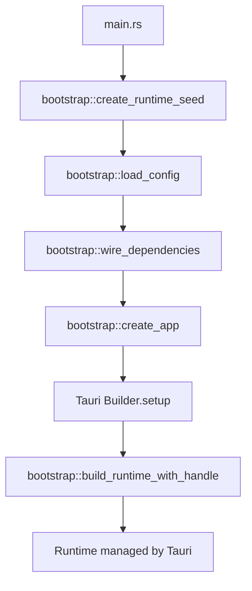

# Bootstrap Architecture Design

**Date / 日期**: 2026-01-12

**Status / 状态**: Approved for Implementation

## Overview / 概述

This document defines the architecture for the bootstrap module in UniClipboard's transition to Hexagonal Architecture. Bootstrap is the "wiring operator" that assembles all infrastructure and platform implementations into the application layer.

本文档定义了 UniClipboard 向六边形架构迁移过程中 bootstrap 模块的架构设计。Bootstrap 是"接线员"，负责将所有基础设施和平台实现组装到应用层。

---

## Core Principle / 核心原则

> **Bootstrap is a "wiring operator", not a "decision maker".**
> **Bootstrap 是"接线员"，不是"决策者"。**
>
> It must stand outside all layers, or the architecture will slowly collapse.
> 它必须站在所有层之外，否则架构一定会慢慢塌。

> **bootstrap is the only place allowed to depend on all implementation layers.**
> **bootstrap 是唯一「允许同时依赖所有实现层」的地方。**
>
> It may not use all implementations, but only here is it architecturally legal to simultaneously depend on `uc-infra` + `uc-platform` + `uc-app`.
> 它不一定要使用所有实现，但只有在这里，同时依赖 `uc-infra` + `uc-platform` + `uc-app` 才是架构合法的。

---

## Target Structure / 目标结构

```
src-tauri/
├── crates/
│   ├── uc-core/          # Pure domain layer (Port definitions) / 纯领域层（Port 定义）
│   ├── uc-infra/         # Infrastructure implementations / 基础设施实现
│   ├── uc-platform/      # Platform adapter implementations / 平台适配器实现
│   ├── uc-app/           # Application layer (use cases, Port-only dependencies) / 应用层（use case，只依赖 Port）
│   └── uc-tauri/         # Tauri entry layer / Tauri 入口层
│       ├── adapters/     # Tauri-specific adapters / Tauri 特定适配器
│       ├── commands/     # Tauri commands / Tauri 命令
│       └── bootstrap/    # ← Dependency injection & assembly (NEW) / 依赖注入 & 组装（新增）
└── src/
    └── main.rs           # Program entry (only calls bootstrap) / 程序入口（只调用 bootstrap）
```

**Dependency Flow / 依赖流向**:

```
main.rs → uc-tauri::bootstrap → [uc-infra, uc-platform]
              ↓
         uc-app (App / UseCases)
              ↓
         uc-core (Ports)
```

---

## Bootstrap Module Structure / Bootstrap 模块结构

```
uc-tauri/src/bootstrap/
├── mod.rs              # Module exports / 模块导出
├── runtime.rs          # AppRuntime creation & lifecycle / AppRuntime 创建与配置
├── wiring.rs           # Dependency injection (construct App directly) / 依赖注入（直接构造 App）
├── config.rs           # Config DTO loading (pure data, no policy) / 配置 DTO 加载（纯数据，无策略）
└── seed.rs             # RuntimeSeed (pre-Tauri setup state) / RuntimeSeed（Tauri setup 前的状态）
```

### Responsibility Matrix / 职责划分

| File / 文件  | Responsibilities / 职责                                                                                                           | May Depend / 可以依赖                    | Prohibited / 禁止事项                                                                                        |
| ------------ | --------------------------------------------------------------------------------------------------------------------------------- | ---------------------------------------- | ------------------------------------------------------------------------------------------------------------ |
| `config.rs`  | Load TOML, device_name, **vault paths (facts only, no state checks)** / 读取 TOML、设备名称、**vault 路径（仅事实，不检查状态）** | `uc-core::config` (DTO only)             | ❌ Check vault state, ❌ Business validation, ❌ Log warnings / ❌ 检查 vault 状态、❌ 业务验证、❌ 日志警告 |
| `wiring.rs`  | Create infra/platform implementations, construct `App::new(deps)` / 创建 infra/platform 实现，直接构造 App                        | `uc-infra`, `uc-platform`, `uc-app::App` | ❌ Any business logic / ❌ 任何业务逻辑                                                                      |
| `runtime.rs` | Create AppRuntime, manage lifecycle / 创建 AppRuntime，管理生命周期                                                               | `uc-app::App`, `uc-platform`             | ❌ Direct concrete implementation dependency / ❌ 直接依赖具体实现                                           |
| `seed.rs`    | Define RuntimeSeed struct / 定义 RuntimeSeed 结构                                                                                 | None / 无                                | ❌ Any dependencies / ❌ 任何依赖                                                                            |
| `mod.rs`     | Export entry functions / 对外暴露入口函数                                                                                         | All internal modules / 所有内部模块      | ❌ Depend on concrete implementations / ❌ 依赖具体实现                                                      |

---

## Key Design Decisions / 关键设计决策

### 1. AppBuilder Complete Removal / AppBuilder 彻底移除

**Decision / 决策**: The `AppBuilder` pattern is permanently removed from `uc-app`.

**Rationale / 理由**:

- `AppBuilder` in `uc-app` violates the layer boundary - app layer should not know how to assemble itself
- `uc-app` 在包含 `AppBuilder` 违反了层边界 - app 层不应该知道如何组装自己
- Builder placement in bootstrap would still be architectural violation
- Builder 放在 bootstrap 仍然是架构违反
- Direct construction is cleaner: constructor signature = dependency manifest
- 直接构造更清晰：构造函数签名即依赖清单

**Implementation / 实现**:

```rust
// uc-app/src/lib.rs
pub struct AppDeps {
    pub clipboard: Arc<dyn ClipboardPort>,
    pub encryption: Arc<dyn EncryptionPort>,
    pub device_repo: Arc<dyn DeviceRepositoryPort>,
    pub network: Arc<dyn NetworkPort>,
    // ... other ports
}

impl App {
    /// Create new App instance
    /// Constructor signature is the dependency manifest
    pub fn new(deps: AppDeps) -> Self { ... }
}

// uc-tauri/src/bootstrap/wiring.rs
let clipboard = Arc::new(LocalClipboard::new(...));
let encryption = Arc::new(SqliteEncryptionRepository::new(...));
// ...

let app = App::new(AppDeps {
    clipboard,
    encryption,
    device_repo,
    network,
});
```

**Note / 注意**: `AppDeps` is **NOT** a Builder pattern - no steps, no defaults, no hidden logic, just parameter grouping.

`AppDeps` **不是** Builder 模式 - 无步骤、无默认值、无隐藏逻辑，仅用于参数打包。

### 2. Config Module Pure DTO / Config 模块纯 DTO

**Decision / 决策**: Rename `uc-core::settings` to `uc-core::config` with strict DTO-only constraint.

将 `uc-core::settings` 重命名为 `uc-core::config`，严格限制为仅 DTO。

**Rationale / 理由**:

- `settings` name inevitably evolves into policies, validation, enable/disable behavior
- `settings` 这个名字几乎必然会演变成策略、验证、启用/禁用行为
- Bootstrap will be blamed for policy violations
- Bootstrap 会被动背锅
- Core will be polluted by strategies
- Core 会被策略污染

**Implementation / 实现**:

```rust
// uc-core/src/config/mod.rs
//! # Pure Data Module / 纯数据模块 - Data Transfer Objects Only
//!
//! **This module contains data only, no policy, no validation.**
//! **此模块只包含数据结构定义，禁止：**
//! - 任何业务逻辑或策略
//! - 验证逻辑
//! - 默认值计算

pub struct AppConfig {
    pub device_name: String,    // May be empty (fact, not error) / 可能为空（事实，非错误）
    pub vault_path: PathBuf,    // May be empty (fact, not error) / 可能为空（事实，非错误）
}
```

### 3. Config Boundary: Facts Only / Config 边界：仅事实

**Iron Rule / 铁律**:

> **config.rs may "discover" vault presence, but must not "care" about it.**
> **config.rs 可以"发现 vault 在不在"，但不能"在意它在不在"。**

**Prohibited in config.rs / config.rs 禁止事项**:

- ❌ Check if vault files exist / ❌ 检查 vault 文件是否存在
- ❌ Throw business errors / ❌ 抛业务错误
- ❌ Log warnings to user / ❌ 向用户记录警告
- ❌ Set default values / ❌ 设置默认值

**Allowed in config.rs / config.rs 允许事项**:

- ✅ Read vault paths (as PathBuf) / ✅ 读取 vault 路径（作为 PathBuf）
- ✅ Parse TOML values (including empty strings) / ✅ 解析 TOML 值（包括空字符串）
- ✅ Return IO/Parse errors / ✅ 返回 IO/解析错误

**Business decisions (like "what to do if vault not initialized") MUST be in uc-app use cases.**

业务决策（如"vault 未初始化时怎么办"）必须在 uc-app use cases 中。

### 4. main.rs Responsibility Boundary / main.rs 职责边界

**Iron Rule / 铁律**:

> **main.rs only allows "startup one-time, host-related" decisions.**
> **main.rs 只允许做「启动期一次性、与宿主强相关」的决策。**
>
> Prohibited: any business logic related to application runtime flow.
> 禁止包含任何与应用运行流程相关的业务逻辑。

| ✅ Allowed (main.rs) / 允许     | ❌ Prohibited (move to uc-app) / 禁止（应移至 uc-app）            |
| ------------------------------- | ----------------------------------------------------------------- |
| Set default device_name         | "What to do if user not logged" / "如果用户未登录就怎样"          |
| Parse command line args         | "What to do if vault uninitialized" / "如果 vault 未初始化就弹窗" |
| Choose runtime mode (dev/prod)  | "What to do if network fails" / "如果网络失败就重试"              |
| Host framework init (Tauri/CLI) | Any business flow-related logic / 任何与业务流程相关的逻辑        |

**Judgment criteria / 判断标准**:

- Is this decision about "how to start"? → main.rs / 这个决策是否与"如何启动"有关？ → main.rs
- Is this decision about "how the app runs"? → uc-app / 这个决策是否与"应用如何运行"有关？ → uc-app

---

## Error Handling Strategy / 错误处理策略

```rust
// bootstrap/config.rs
/// Config loading errors (IO/parse only, no business errors)
/// 配置加载错误（仅 IO/解析错误，无业务错误）
pub enum ConfigError {
    Io(std::io::Error),
    Parse(toml::de::Error),
    // NO: Missing(String) - "missing" is a decision, not a fact
    // ❌ Missing(String) - "缺失"是决策，不是事实
}

// bootstrap/wiring.rs
/// Dependency injection errors (infrastructure init failures)
/// 依赖注入错误（基础设施初始化失败）
pub enum WiringError {
    DatabaseInit(String),
    KeyringInit(String),
    ClipboardInit(String),
}

// uc-app/use_cases/
/// Business errors (use case execution failures)
/// 业务错误（use case 执行失败）
pub enum UseCaseError {
    EncryptionNotInitialized,
    DeviceNotFound,
    PermissionDenied,
}
```

**Error Layering / 错误分层**:

| Error Type / 错误类型 | Location / 发生位置 | Default Handling / 默认处理                           | Allowed Variants / 允许的变体                                                          |
| --------------------- | ------------------- | ----------------------------------------------------- | -------------------------------------------------------------------------------------- |
| `ConfigError`         | `config.rs`         | Recoverable (use defaults) / 可恢复（用默认值）       | -                                                                                      |
| `WiringError`         | `wiring.rs`         | Default fatal                                         | **Allowed to decide based on runtime mode (CLI/GUI/debug)** / **允许根据运行模式决定** |
| `UseCaseError`        | `uc-app`            | Convert to user-friendly message / 转换成用户友好消息 | -                                                                                      |

**About WiringError / 关于 WiringError**:

> **WiringError defaults to fatal, but main/host may decide handling based on runtime mode (CLI / GUI / debug).**
> **WiringError 默认视为 fatal，但允许 main / 宿主根据运行模式（CLI / GUI / debug）决定处理方式。**
>
> This doesn't constrain future CLI versions or debug modes.
> 这样不会限制未来的 CLI 版本或调试模式。

---

## Application Startup Flow / 应用启动流程



**Flow Explanation / 流程说明**:

1. **main.rs** → Create RuntimeSeed (no Tauri dependency) / 创建 RuntimeSeed（无 Tauri 依赖）
2. **load_config** → Read TOML, return pure DTO / 读取 TOML，返回纯 DTO
3. **wire_dependencies** → Create all implementations, assemble AppDeps / 创建所有实现，组装 AppDeps
4. **create_app** → Construct App / 构造 App
5. **Tauri.setup** → Create adapters that need AppHandle / 创建需要 AppHandle 的适配器
6. **build_runtime_with_handle** → Complete final Runtime / 完成最终 Runtime

---

## Migration Plan / 迁移计划

### Current State Analysis / 当前状态分析

| Component / 组件          | Current Location / 当前位置 | Target Location / 目标位置                                                              | Complexity / 迁移复杂度 |
| ------------------------- | --------------------------- | --------------------------------------------------------------------------------------- | ----------------------- |
| `AppBuilder`              | `uc-app/src/builder.rs`     | ❌ Remove, use `App::new(AppDeps)` / ❌ 移除，改用 `App::new(AppDeps)`                  | Low / 低                |
| Config loading logic      | `main.rs` (lines 29-62)     | `uc-tauri/src/bootstrap/config.rs`                                                      | Medium / 中             |
| Device registration logic | `main.rs` (lines 94-134)    | `uc-app` (use case)                                                                     | High / 高               |
| Vault state check         | `main.rs` (lines 64-82)     | ❌ Remove (business decision, belongs in use case) / ❌ 移除（业务决策，应在 use case） | Low / 低                |
| Dependency injection      | `main.rs` (lines 148-156)   | `uc-tauri/src/bootstrap/wiring.rs`                                                      | High / 高               |
| AppRuntime creation       | `infrastructure/runtime.rs` | `uc-tauri/src/bootstrap/runtime.rs`                                                     | Medium / 中             |

### Phase 1: Foundation / 基础（不影响现有功能）

1. Create `uc-core/src/config/` module (pure DTO) / 创建纯 DTO 模块
2. Create `AppDeps` struct in `uc-app/src/lib.rs` / 在 uc-app 创建 AppDeps 结构
3. Add `App::new(deps: AppDeps)` constructor to `uc-app::App` / 添加构造函数
4. Temporarily keep `AppBuilder` (backward compatibility) / 暂时保留 AppBuilder（向后兼容）

```bash
git commit -m "feat(uc-app): add AppDeps and App::new() constructor"
```

### Phase 2: Bootstrap Module Creation / Bootstrap 模块创建

1. Create `uc-tauri/src/bootstrap/` directory structure / 创建目录结构
2. Implement `config.rs` (migrate config reading from main.rs) / 从 main.rs 迁移配置读取
3. Implement `wiring.rs` (return empty AppDeps for now) / 暂时返回空的 AppDeps
4. Add tests to verify config loading / 添加测试验证配置加载

```bash
git commit -m "feat(uc-tauri): add bootstrap module skeleton"
```

### Phase 3: Gradual Dependency Injection Migration / 逐步迁移依赖注入 ✅ COMPLETED

**Completed on / 完成于**: 2026-01-12

**Changes made / 完成的变更**:

1. ✅ Implemented infra layer creation in wiring.rs / 在 wiring.rs 实现 infra 层创建
2. ✅ Implemented platform layer creation in wiring.rs / 在 wiring.rs 实现 platform 层创建
3. ✅ Created wire_dependencies() function / 创建 wire_dependencies() 函数
4. ✅ Updated main.rs to use bootstrap flow / 更新 main.rs 使用 bootstrap 流程
5. ✅ Removed legacy dependency injection code / 移除旧的依赖注入代码
6. ✅ Added integration tests / 添加集成测试

**Commits / 提交记录**:

- `feat(uc-app): extend AppDeps with all required ports`
- `feat(uc-tauri): add WiringError and WiringResult types`
- `feat(uc-tauri): add database pool creation function`
- `feat(uc-tauri): add infra layer repository creation`
- `feat(uc-tauri): add platform layer creation`
- `feat(uc-tauri): implement wire_dependencies function`
- `feat(uc-platform): add placeholder implementations for runtime ports`
- `refactor: use bootstrap flow for dependency injection`
- `refactor: remove legacy dependency injection code`
- `test(uc-tauri): add bootstrap integration tests`

**Implementation summary / 实施总结**:

The bootstrap module now fully handles dependency injection for the application. The wiring.rs module creates all infrastructure (database repositories, encryption) and platform (clipboard, network) implementations, then assembles them into an AppDeps struct for injection into the App.

Bootstrap 模块现已完全处理应用程序的依赖注入。wiring.rs 模块创建所有基础设施（数据库仓库、加密）和平台（剪贴板、网络）实现，然后将它们组装成 AppDeps 结构体注入到 App 中。

**Key files modified / 修改的关键文件**:

- `src-tauri/crates/uc-tauri/src/bootstrap/wiring.rs` - Core dependency injection logic / 核心依赖注入逻辑
- `src-tauri/crates/uc-app/src/lib.rs` - Extended AppDeps with all ports / 扩展 AppDeps 包含所有端口
- `src-tauri/crates/uc-platform/src/ports/runtime.rs` - Added placeholder port implementations / 添加占位符端口实现
- `src-tauri/src/main.rs` - Updated to use bootstrap flow / 更新使用 bootstrap 流程
- `src-tauri/crates/uc-tauri/src/bootstrap/tests.rs` - Added integration tests / 添加集成测试

### Phase 4: Cleanup / 清理

1. Remove `uc-app/src/builder.rs` / 移除 AppBuilder
2. Remove initialization code from `main.rs` / 移除 main.rs 中的初始化代码
3. Remove vault state check (move to use case) / 移除 vault 状态检查（移至 use case）
4. Update all call sites / 更新所有调用点
5. 移除旧的代码，不需要向后兼容

```bash
git commit -m "refactor: remove legacy AppBuilder and cleanup"
```

---

## Architecture Validation Checklist / 架构验证清单

**After each migration phase, use this checklist to verify architectural health:**
**在每次迁移后，使用此清单验证架构健康度：**

- ☐ **Self-check 1**: Can bootstrap be directly depended upon by test crates?
  **自检问题 1**：bootstrap 能否被测试 crate 直接依赖？
  - Expected: ❌ No / 应该：❌ 否
  - Actual: **_ / 实际：_**

- ☐ **Self-check 2**: Can business code compile independently without bootstrap?
  **自检问题 2**：删掉 bootstrap，业务代码还能单独编译吗？
  - Expected: ✅ Yes / 应该：✅ 是
  - Actual: **_ / 实际：_**

- ☐ **Self-check 3**: Does bootstrap "know too much" about concrete implementations?
  **自检问题 3**：bootstrap 是否"知道太多具体实现细节"？
  - Expected: ✅ Yes (that's its job) / 应该：✅ 是（这是它的职责）
  - Actual: **_ / 实际：_**

- ☐ **Self-check 4**: Does config.rs check vault state?
  **自检问题 4**：config.rs 是否检查了 vault 状态？
  - Expected: ❌ No / 应该：❌ 否
  - Actual: **_ / 实际：_**

- ☐ **Self-check 5**: Does main.rs contain long-term business policies?
  **自检问题 5**：main.rs 是否包含长期业务策略？
  - Expected: ❌ No / 应该：❌ 否
  - Actual: **_ / 实际：_**

- ☐ **Self-check 6**: Does AppBuilder still exist?
  **自检问题 6**：AppBuilder 是否还存在？
  - Expected: ❌ No / 应该：❌ 否
  - Actual: **_ / 实际：_**

- ☐ **Self-check 7**: Does uc-core::config contain only DTOs?
  **自检问题 7**：uc-core::config 是否只包含 DTO？
  - Expected: ✅ Yes / 应该：✅ 是
  - Actual: **_ / 实际：_**

- ☐ **Self-check 8**: Is WiringError assumed "always fatal"?
  **自检问题 8**：WiringError 是否被假定为"永远 fatal"？
  - Expected: ❌ No (allow runtime-mode-based handling) / 应该：❌ 否（允许根据运行模式调整）
  - Actual: **_ / 实际：_**

---

## File Comment Templates / 文件注释模板

### uc-tauri/src/bootstrap/mod.rs

```rust
//! # Bootstrap Module / Bootstrap 模块
//!
//! ## Responsibilities / 职责
//!
//! This is the **only place allowed to depend on all implementation layers**.
//! 这是 **唯一允许同时依赖所有实现层** 的地方。
//! Responsible for injecting infra + platform implementations into the app layer.
//! 负责将 infra + platform 实现注入到 app 层。
//!
//! ## Prohibited / 禁止事项
//!
//! ❌ **No business logic / 禁止包含任何业务逻辑**
//! - Business rules must be in uc-app use cases
//! - 业务规则必须在 uc-app 的 use cases 中
//!
//! ❌ **No configuration validation or business decisions / 禁止做配置验证或业务决策**
//! - Config: read only, no validity checks
//! - 配置只读取，不判断有效性
//! - Business decisions (e.g. what to do if vault uninitialized) belong in use case
//! - 业务决策（如 vault 未初始化时怎么办）在 use case
//!
//! ❌ **No dependencies from other crates / 禁止被其他 crate 依赖**
//! - bootstrap is binary-only code
//! - bootstrap 是 binary-only 代码
//! - If tests need to depend, responsibility is misplaced
//! - 如果测试需要依赖，说明职责放错位置
//!
//! ## Architecture Principle / 架构原则
//!
//! > **Bootstrap is a "wiring operator", not a "decision maker".**
//! > **Bootstrap 是"接线员"，不是"决策者"。**
//! > It must stand outside all layers, or the architecture will slowly collapse.
//! > 它必须站在所有层之外，否则架构一定会慢慢塌。
```

### uc-tauri/src/bootstrap/config.rs

```rust
//! # Configuration Loader / 配置加载模块
//!
//! ## Responsibilities / 职责
//!
//! - ✅ Read TOML files / 读取 TOML 文件
//! - ✅ Parse into AppConfig DTO / 解析为 AppConfig DTO
//! - ✅ Read path info (without checking file existence) / 读取路径信息（不检查文件是否存在）
//!
//! ## Prohibited / 禁止事项
//!
//! ❌ **No vault file existence checks / 禁止检查 vault 文件是否存在**
//! - May "discover" vault presence, but must not "care" about it
//! - 可以"发现 vault 在不在"，但不能"在意它在不在"
//! - State checking is a business decision, belongs in uc-app use case
//! - 状态检查是业务决策，应在 uc-app use case
//!
//! ❌ **No configuration validation / 禁止验证配置有效性**
//! - Do not judge if device_name is valid
//! - 不判断 device_name 是否合法
//! - Do not judge if port is in reasonable range
//! - 不判断端口是否在合理范围
//!
//! ❌ **No default values / 禁止设置默认值**
//! - Empty string is a valid "fact"
//! - 空字符串是合法的"事实"
//! - Default values are business decisions, should be in main.rs or use case
//! - 默认值是业务决策，应由 main.rs 或 use case 决定
//!
//! ❌ **No business logging or warnings / 禁止业务日志或警告**
//! - Do not print "vault does not exist, please initialize first"
//! - 不要打印"vault 不存在，请先初始化"
//! - Only return ConfigError on IO errors
//! - 只在 IO 错误时返回 ConfigError
//!
//! ## Iron Rule / 铁律
//!
//! > **May "discover" vault presence, but must not "care" about it.**
//! > **可以"发现 vault 在不在"，但不能"在意它在不在"。**
```

### uc-tauri/src/bootstrap/wiring.rs

```rust
//! # Dependency Injection / 依赖注入模块
//!
//! ## Responsibilities / 职责
//!
//! - ✅ Create infra implementations (db, fs, keyring) / 创建 infra 层具体实现
//! - ✅ Create platform implementations (clipboard, network) / 创建 platform 层具体实现
//! - ✅ Inject all dependencies into App / 将所有依赖注入到 App
//!
//! ## Prohibited / 禁止事项
//!
//! ❌ **No business logic / 禁止包含任何业务逻辑**
//! - Do not decide "what to do if encryption uninitialized"
//! - 不判断"如果加密未初始化就怎样"
//! - Do not handle "what to do if device not registered"
//! - 不处理"如果设备未注册就怎样"
//!
//! ❌ **No configuration validation / 禁止做配置验证**
//! - Config already loaded in config.rs
//! - 配置已在 config.rs 加载
//! - Validation should be in use case or upper layer
//! - 验证应在 use case 或上层
//!
//! ❌ **No direct concrete implementation usage / 禁止直接使用具体实现**
//! - Must inject through Port traits
//! - 必须通过 Port trait 注入
//! - Do not call implementation methods directly after App construction
//! - 不在 App 构造后直接调用实现方法
//!
//! ## Architecture Principle / 架构原则
//!
//! > **This is the only place allowed to depend on uc-infra + uc-platform + uc-app simultaneously.**
//! > **这是唯一允许同时依赖 uc-infra + uc-platform + uc-app 的地方。**
//! > But this privilege is only for "assembly", not for "decision making".
//! > 但这种特权仅用于"组装"，不用于"决策"。
```

### uc-core/src/config/mod.rs

```rust
//! # Pure Data Module / 纯数据模块 - Data Transfer Objects Only
//!
//! ## Responsibilities / 职责
//!
//! - ✅ Define configuration data structures / 定义配置数据结构
//! - ✅ Provide TOML → DTO mapping / 提供 TOML → DTO 的映射
//!
//! ## Prohibited / 禁止事项
//!
//! ❌ **No business logic or policies / 禁止任何业务逻辑或策略**
//! - Do not judge "if this value is reasonable"
//! - 不判断"这个值是否合理"
//! - Do not provide "default value calculation" logic
//! - 不提供"默认值计算"逻辑
//!
//! ❌ **No validation logic / 禁止验证逻辑**
//! - Do not implement `validate()` methods
//! - 不实现 `validate()` 方法
//! - Do not check consistency between fields
//! - 不检查字段之间的一致性
//!
//! ❌ **No default value calculation / 禁止默认值计算**
//! - `device_name: String` can be empty string
//! - `device_name: String` 可以是空字符串
//! - `port: u16` can be 0
//! - `port: u16` 可以是 0
//! - Default values are decided by caller
//! - 默认值由调用者决定
//!
//! ## Iron Rule / 铁律
//!
//! > **This module contains data only, no policy, no validation.**
//! > **此模块只包含数据结构定义，禁止：任何业务逻辑或策略、验证逻辑、默认值计算。**
```

### src-tauri/src/main.rs

```rust
//! # UniClipboard Main Entry / UniClipboard 主程序入口
//!
//! ## Responsibilities / 职责
//!
//! - ✅ Call bootstrap to load configuration / 调用 bootstrap 加载配置
//! - ✅ One-time startup decisions (default device_name) / 启动期一次性决策
//! - ✅ Initialize Tauri application / 初始化 Tauri 应用
//!
//! ## Prohibited / 禁止事项
//!
//! ❌ **No long-term business policies / 禁止包含长期业务策略**
//! - Do not decide "what to do if user not logged in"
//! - 不判断"如果用户未登录就怎样"
//! - Do not handle "show popup if vault uninitialized"
//! - 不处理"如果 vault 未初始化就弹窗"
//! - These logic must be in uc-app use cases
//! - 这些逻辑必须在 uc-app use cases
//!
//! ❌ **No direct infra/platform implementation creation / 禁止直接创建 infra/platform 实现**
//! - Dependency injection must be in bootstrap/wiring.rs
//! - 依赖注入必须在 bootstrap/wiring.rs
//!
//! ## Iron Rule / 铁律
//!
//! > **main.rs only allows "startup one-time, host-related" decisions.**
//! > **main.rs 只允许做「启动期一次性、与宿主强相关」的决策。**
//! > Prohibited: any business logic related to application runtime flow.
//! > 禁止包含任何与应用运行流程相关的业务逻辑。
```

---

## References / 参考

- **Project DeepWiki**: https://deepwiki.com/UniClipboard/UniClipboard
- **Hexagonal Architecture**: Alistair Cockburn's Ports and Adapters pattern
- **Clean Architecture**: Robert C. Martin's layered architecture principles

---

**Document Version / 文档版本**: 1.0
**Last Updated / 最后更新**: 2026-01-12
**Status / 状态**: ✅ Approved - Ready for Implementation
