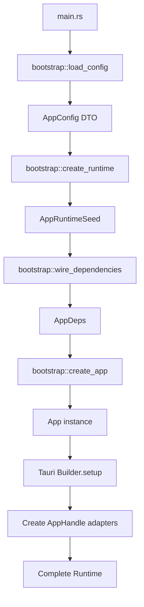

# Bootstrap Module / Bootstrap 模块

## Purpose / 目的

Bootstrap is the **only place allowed to depend on all implementation layers**.
Bootstrap 是 **唯一允许同时依赖所有实现层** 的地方。

Responsible for injecting infra + platform implementations into the app layer.
负责将 infra + platform 实现注入到 app 层。

**Core Principle / 核心原则**:

> **Bootstrap is a "wiring operator", not a "decision maker".**
> **Bootstrap 是"接线员"，不是"决策者"。**
>
> It must stand outside all layers, or the architecture will slowly collapse.
> 它必须站在所有层之外，否则架构一定会慢慢塌。
>
> **bootstrap is the only place allowed to depend on all implementation layers.**
> **bootstrap 是唯一「允许同时依赖所有实现层」的地方。**
>
> It may not use all implementations, but only here is it architecturally legal to simultaneously depend on `uc-infra` + `uc-platform` + `uc-app`.
> 它不一定要使用所有实现，但只有在这里，同时依赖 `uc-infra` + `uc-platform` + `uc-app` 才是架构合法的。

---

## Architecture Principle / 架构原则

### Dependency Flow / 依赖流向

```
main.rs → uc-tauri::bootstrap → [uc-infra, uc-platform]
              ↓
         uc-app (App / UseCases)
              ↓
         uc-core (Ports)
```

**Key Insight / 关键洞察**:

- Bootstrap stands **outside** all layers / Bootstrap 站在**所有层之外**
- It knows about concrete implementations (that's its job) / 它知道具体实现（这是它的职责）
- But it must not make business decisions / 但它必须不做业务决策
- All business logic belongs in `uc-app` use cases / 所有业务逻辑属于 `uc-app` use cases

---

## Module Structure / 模块结构

```
uc-tauri/src/bootstrap/
├── mod.rs              # Module exports / 模块导出
├── config.rs           # Config DTO loading (pure data, no policy) / 配置 DTO 加载（纯数据，无策略）
├── wiring.rs           # Dependency injection (construct App directly) / 依赖注入（直接构造 App）
├── runtime.rs          # AppRuntime creation & lifecycle / AppRuntime 创建与配置
└── run.rs              # Tauri setup & app execution / Tauri 设置与应用执行
```

### File Overview / 文件概览

| File / 文件  | Purpose / 目的                                        | Status / 状态                             |
| ------------ | ----------------------------------------------------- | ----------------------------------------- |
| `mod.rs`     | Export public API / 对外暴露公共 API                  | ✅ Complete                               |
| `config.rs`  | Load TOML → AppConfig DTO / 加载 TOML → AppConfig DTO | ✅ Complete                               |
| `wiring.rs`  | Wire dependencies / 连接依赖                          | 🔄 Phase 2: Skeleton / Phase 3: Real impl |
| `runtime.rs` | Create AppRuntime / 创建 AppRuntime                   | ✅ Complete                               |
| `run.rs`     | Tauri setup / Tauri 设置                              | ⏳ Phase 3 integration                    |

---

## Responsibility Matrix / 职责划分

| File / 文件  | Responsibilities / 职责                                                                                                           | May Depend / 可以依赖                    | Prohibited / 禁止事项                                                                                        |
| ------------ | --------------------------------------------------------------------------------------------------------------------------------- | ---------------------------------------- | ------------------------------------------------------------------------------------------------------------ |
| `config.rs`  | Load TOML, device_name, **vault paths (facts only, no state checks)** / 读取 TOML、设备名称、**vault 路径（仅事实，不检查状态）** | `uc-core::config` (DTO only)             | ❌ Check vault state, ❌ Business validation, ❌ Log warnings / ❌ 检查 vault 状态、❌ 业务验证、❌ 日志警告 |
| `wiring.rs`  | Create infra/platform implementations, construct `App::new(deps)` / 创建 infra/platform 实现，直接构造 App                        | `uc-infra`, `uc-platform`, `uc-app::App` | ❌ Any business logic / ❌ 任何业务逻辑                                                                      |
| `runtime.rs` | Create AppRuntime, manage lifecycle / 创建 AppRuntime，管理生命周期                                                               | `uc-app::App`, `uc-platform`             | ❌ Direct concrete implementation dependency / ❌ 直接依赖具体实现                                           |
| `run.rs`     | Tauri setup, create AppHandle-dependent adapters / Tauri 设置，创建需要 AppHandle 的适配器                                        | All bootstrap modules                    | ❌ Business logic about "what to do if X fails" / ❌ 关于"X 失败时怎么办"的业务逻辑                          |

---

## Iron Rules / 铁律

### 1. Config Boundary: Facts Only / Config 边界：仅事实

> **config.rs may "discover" vault presence, but must not "care" about it.**
> **config.rs 可以"发现 vault 在不在"，但不能"在意它在不在"。**

**Prohibited in config.rs / config.rs 禁止事项**:

- ❌ Check if vault files exist / ❌ 检查 vault 文件是否存在
- ❌ Throw business errors / ❌ 抛业务错误
- ❌ Log warnings to user / ❌ 向用户记录警告
- ❌ Set default values / ❌ 设置默认值
- ❌ Validate configuration values / ❌ 验证配置值

**Allowed in config.rs / config.rs 允许事项**:

- ✅ Read vault paths (as PathBuf) / ✅ 读取 vault 路径（作为 PathBuf）
- ✅ Parse TOML values (including empty strings) / ✅ 解析 TOML 值（包括空字符串）
- ✅ Return IO/Parse errors / ✅ 返回 IO/解析错误

**Rationale / 理由**:

> "Vault file doesn't exist" is a **business fact**, not a loading error.
> "Vault 文件不存在"是**业务事实**，不是加载错误。
>
> What to do about it (initialize? show dialog? use defaults?) is a **business decision** that belongs in `uc-app` use cases.
> 如何处理（初始化？弹窗？用默认值？）是**业务决策**，属于 `uc-app` use cases。

---

### 2. Wiring Boundary: Assembly Only / Wiring 边界：仅组装

> **wiring.rs creates implementations but must not make business decisions.**
> **wiring.rs 创建实现但不能做业务决策。**

**Prohibited in wiring.rs / wiring.rs 禁止事项**:

- ❌ Decide "what to do if encryption uninitialized" / ❌ 判断"如果加密未初始化就怎样"
- ❌ Handle "what to do if device not registered" / ❌ 处理"如果设备未注册就怎样"
- ❌ Validate configuration values / ❌ 验证配置值
- ❌ Call implementation methods directly after App construction / ❌ 在 App 构造后直接调用实现方法
- ❌ Add conditional logic based on config values / ❌ 基于配置值添加条件逻辑

**Allowed in wiring.rs / wiring.rs 允许事项**:

- ✅ Create infra implementations (db, fs, keyring) / ✅ 创建 infra 层实现（数据库、文件系统、密钥环）
- ✅ Create platform implementations (clipboard, network) / ✅ 创建 platform 层实现（剪贴板、网络）
- ✅ Inject all dependencies into `App::new(AppDeps)` / ✅ 将所有依赖注入到 `App::new(AppDeps)`
- ✅ Return errors if dependency construction fails / ✅ 如果依赖构造失败则返回错误

**Rationale / 理由**:

> Wiring is purely mechanical: "create these implementations, pass them to App".
> 连接纯粹是机械的："创建这些实现，传递给 App"。
>
> Any "if X then Y" logic about business flows belongs in use cases.
> 任何关于业务流程的"如果 X 则 Y"逻辑都属于 use cases。

---

### 3. Main.rs Boundary: Startup Only / Main.rs 边界：仅启动

> **main.rs only allows "startup one-time, host-related" decisions.**
> **main.rs 只允许做「启动期一次性、与宿主强相关」的决策。**

**Allowed in main.rs / main.rs 允许事项**:

- ✅ Set default device_name / ✅ 设置默认设备名称
- ✅ Parse command line args / ✅ 解析命令行参数
- ✅ Choose runtime mode (dev/prod) / ✅ 选择运行模式（开发/生产）
- ✅ Host framework init (Tauri/CLI) / ✅ 宿主框架初始化（Tauri/CLI）

**Prohibited in main.rs / main.rs 禁止事项**:

- ❌ "What to do if user not logged" / ❌ "如果用户未登录就怎样"
- ❌ "What to do if vault uninitialized" / ❌ "如果 vault 未初始化就弹窗"
- ❌ "What to do if network fails" / ❌ "如果网络失败就重试"
- ❌ Any business flow-related logic / ❌ 任何与业务流程相关的逻辑

**Judgment Criteria / 判断标准**:

- Is this decision about "how to start"? → main.rs / 这个决策是否与"如何启动"有关？ → main.rs
- Is this decision about "how the app runs"? → uc-app / 这个决策是否与"应用如何运行"有关？ → uc-app

---

## Usage Example / 使用示例

### Phase 1-3 Flow / 阶段 1-3 流程

```rust
use uc_tauri::bootstrap::{load_config, create_runtime, wire_dependencies, create_app};
use std::path::PathBuf;

// Phase 1: Load configuration (pure DTO, no validation)
// 阶段 1：加载配置（纯 DTO，无验证）
let config = load_config(PathBuf::from("~/.config/uniclipboard/config.toml"))?;

// Phase 1: Create runtime seed (holds config before Tauri setup)
// 阶段 1：创建运行时种子（在 Tauri 设置之前保存配置）
let seed = create_runtime(config)?;

// Phase 2: Wire all dependencies (creates all infra/platform implementations)
// 阶段 2：连接所有依赖（创建所有 infra/platform 实现）
let deps = wire_dependencies(&seed.config)?;

// Phase 3: Create App from dependencies (direct construction, no builder)
// 阶段 3：从依赖创建 App（直接构造，无 builder）
let app = create_app(deps);

// Phase 3: In Tauri setup, create AppHandle-dependent adapters
// 阶段 3：在 Tauri 设置中，创建需要 AppHandle 的适配器
let tauri_autostart = Arc::new(TauriAutostart::new(app_handle));
let tauri_ui_port = Arc::new(TauriUiPort::new(app_handle, "settings"));
```

### Complete Startup Flow / 完整启动流程



---

## Phase Status / 阶段状态

### Current Implementation Status / 当前实现状态

- ✅ **Phase 1**: Foundation (completed) / 基础（已完成）
  - `uc-core::config::AppConfig` DTO / `uc-core::config::AppConfig` DTO
  - `uc-app::AppDeps` struct / `uc-app::AppDeps` 结构
  - `App::new(deps)` constructor / `App::new(deps)` 构造函数

- 🔄 **Phase 2**: Bootstrap Module Creation (current) / Bootstrap 模块创建（当前）
  - ✅ `config.rs` - Pure config loading / 纯配置加载
  - 🔄 `wiring.rs` - Skeleton (real impl in Phase 3) / 骨架（真实实现在 Phase 3）
  - ✅ `runtime.rs` - Runtime creation / Runtime 创建
  - ⏳ `run.rs` - Integration (Phase 3) / 集成（Phase 3）

- ⏳ **Phase 3**: Gradual Dependency Injection Migration (next) / 逐步依赖注入迁移（下一步）
  - Implement real infra layer creation in `wiring.rs` / 在 `wiring.rs` 实现真实 infra 层创建
  - Implement real platform layer creation in `wiring.rs` / 在 `wiring.rs` 实现真实 platform 层创建
  - Update `run.rs` to use new bootstrap flow / 更新 `run.rs` 使用新的 bootstrap 流程

- ⏳ **Phase 4**: Cleanup (final) / 清理（最后）
  - Remove legacy `AppBuilder` from `uc-app` / 从 `uc-app` 移除遗留的 `AppBuilder`
  - Remove initialization code from `main.rs` / 从 `main.rs` 移除初始化代码
  - Remove vault state check (move to use case) / 移除 vault 状态检查（移至 use case）

### Test Coverage / 测试覆盖

```
✅ Phase 1: 5/5 tests PASS
✅ Phase 2: 9/9 tests PASS (4 config + 5 integration)
⏳ Phase 3: TBD
```

---

## Migration Notes / 迁移说明

### Why This Module Exists / 为什么存在这个模块

**Problem / 问题**:

The legacy architecture had dependency injection scattered across multiple places:
遗留架构的依赖注入分散在多个地方：

- `main.rs` - Created some implementations / 创建了一些实现
- `AppBuilder` - Created other implementations / 创建了其他实现
- Various initialization code - Business logic mixed with wiring / 各种初始化代码 - 业务逻辑与连接混在一起

**Solution / 解决方案**:

Bootstrap module consolidates ALL dependency injection in ONE place:
Bootstrap 模块将所有依赖注入集中在一个地方：

1. **Single responsibility** / **单一职责**:
   - Bootstrap ONLY wires dependencies / Bootstrap 只连接依赖
   - uc-app ONLY contains business logic / uc-app 只包含业务逻辑

2. **Clear boundaries** / **清晰的边界**:
   - config.rs: Facts only / 仅事实
   - wiring.rs: Assembly only / 仅组装
   - runtime.rs: Lifecycle only / 仅生命周期

3. **Testable** / **可测试**:
   - Each module can be tested independently / 每个模块可以独立测试
   - Mock implementations can be injected during testing / 测试期间可以注入模拟实现

### Before vs After / 之前 vs 之后

**Before (Legacy) / 之前（遗留）**:

```rust
// main.rs - Mixed concerns
let setting = load_setting()?;
if !setting.vault_path.exists() {
    // ❌ Business logic in main.rs
    show_dialog("Vault not initialized");
}

// AppBuilder - Violates layer boundary
let app = AppBuilder::new()
    .with_clipboard(Arc::new(LocalClipboard::new()))
    .with_encryption(Arc::new(SqliteEncryptionRepository::new()))
    .build()?;
```

**After (Hexagonal) / 之后（六边形）**:

```rust
// bootstrap/config.rs - Pure data loading
let config = load_config(config_path)?; // No checks, no validation

// bootstrap/wiring.rs - Pure assembly
let deps = wire_dependencies(&config)?; // Create implementations, wire them

// uc-app/use_cases/ - Business logic
if !encryption.is_initialized() {
    // ✅ Business decision in use case
    ui_port.show_dialog("Vault not initialized");
}

let app = App::new(deps); // Direct construction
```

---

## Error Handling Strategy / 错误处理策略

### Error Layering / 错误分层

| Error Type / 错误类型 | Location / 发生位置 | Default Handling / 默认处理                                        | Allowed Variants / 允许的变体                                                       |
| --------------------- | ------------------- | ------------------------------------------------------------------ | ----------------------------------------------------------------------------------- |
| `ConfigError`         | `config.rs`         | Recoverable (use defaults) / 可恢复（用默认值）                    | Io, Parse / IO、解析                                                                |
| `WiringError`         | `wiring.rs`         | Default fatal, but runtime-mode-aware / 默认 fatal，但感知运行模式 | DatabaseInit, KeyringInit, ClipboardInit / 数据库初始化、密钥环初始化、剪贴板初始化 |
| `UseCaseError`        | `uc-app`            | Convert to user-friendly message / 转换成用户友好消息              | Business-specific errors / 业务特定错误                                             |

### About WiringError / 关于 WiringError

> **WiringError defaults to fatal, but main/host may decide handling based on runtime mode (CLI / GUI / debug).**
> **WiringError 默认视为 fatal，但允许 main / 宿主根据运行模式（CLI / GUI / debug）决定处理方式。**

This doesn't constrain future CLI versions or debug modes.
这样不会限制未来的 CLI 版本或调试模式。

**Example / 示例**:

```rust
// bootstrap/wiring.rs
pub fn wire_dependencies(config: &AppConfig) -> Result<AppDeps, WiringError> {
    let db = SqliteRepresentationRepository::new(&config.database_path)
        .map_err(|e| WiringError::DatabaseInit(e.to_string()))?;

    // ... create other implementations

    Ok(AppDeps { /* ... */ })
}

// main.rs (GUI mode)
match wire_dependencies(&config) {
    Ok(deps) => run_app(deps),
    Err(e) => {
        // Show error dialog to user
        show_error_dialog(&format!("Failed to initialize: {}", e));
        std::process::exit(1);
    }
}

// main.rs (CLI mode)
match wire_dependencies(&config) {
    Ok(deps) => run_cli(deps),
    Err(WiringError::DatabaseInit(msg)) => {
        // CLI might retry with different config
        eprintln!("Database init failed: {}", msg);
        try_fallback_db()?;
    }
}
```

---

## Architecture Validation / 架构验证

### Self-Check Questions / 自检问题

After each migration phase, use this checklist to verify architectural health:
在每次迁移后，使用此清单验证架构健康度：

- ☐ **Self-check 1**: Can bootstrap be directly depended upon by test crates?
  **自检问题 1**：bootstrap 能否被测试 crate 直接依赖？
  - Expected: ❌ No / 应该：❌ 否
  - Reason: Bootstrap is binary-only code / 原因：Bootstrap 是 binary-only 代码
  - If tests need bootstrap, responsibility is misplaced / 如果测试需要 bootstrap，说明职责放错位置

- ☐ **Self-check 2**: Can business code compile independently without bootstrap?
  **自检问题 2**：删掉 bootstrap，业务代码还能单独编译吗？
  - Expected: ✅ Yes / 应该：✅ 是
  - Reason: uc-app should only depend on uc-core (Ports) / 原因：uc-app 应该只依赖 uc-core (Ports)
  - If bootstrap is required, layer boundary is violated / 如果需要 bootstrap，则违反了层边界

- ☐ **Self-check 3**: Does bootstrap "know too much" about concrete implementations?
  **自检问题 3**：bootstrap 是否"知道太多具体实现细节"？
  - Expected: ✅ Yes (that's its job) / 应该：✅ 是（这是它的职责）
  - Reason: Bootstrap IS the wiring operator / 原因：Bootstrap 就是接线员
  - It's OK for bootstrap to know about uc-infra and uc-platform / bootstrap 知道 uc-infra 和 uc-platform 是正常的

- ☐ **Self-check 4**: Does config.rs check vault state?
  **自检问题 4**：config.rs 是否检查了 vault 状态？
  - Expected: ❌ No / 应该：❌ 否
  - Reason: Config should only read facts, not care about state / 原因：Config 应该只读取事实，不关心状态
  - If config checks file existence, it's violating the boundary / 如果 config 检查文件存在性，则违反了边界

- ☐ **Self-check 5**: Does main.rs contain long-term business policies?
  **自检问题 5**：main.rs 是否包含长期业务策略？
  - Expected: ❌ No / 应该：❌ 否
  - Reason: main.rs should only do startup decisions / 原因：main.rs 应该只做启动决策
  - Business policies belong in use cases / 业务策略属于 use cases

- ☐ **Self-check 6**: Does wiring.rs contain business logic?
  **自检问题 6**：wiring.rs 是否包含业务逻辑？
  - Expected: ❌ No / 应该：❌ 否
  - Reason: Wiring should only create implementations, not make decisions / 原因：Wiring 应该只创建实现，不做决策
  - If wiring has "if X then Y" logic, it's doing too much / 如果 wiring 有"如果 X 则 Y"逻辑，说明做得太多

---

## Related Documentation / 相关文档

### Design Documents / 设计文档

- **Architecture Design**: [docs/plans/2026-01-12-bootstrap-architecture-design.md](../../../../docs/plans/2026-01-12-bootstrap-architecture-design.md)
- **Phase 1 Plan**: [docs/plans/2026-01-12-bootstrap-phase1-foundation.md](../../../../docs/plans/2026-01-12-bootstrap-phase1-foundation.md)
- **Phase 2 Plan**: [docs/plans/2026-01-12-bootstrap-phase2-creation.md](../../../../docs/plans/2026-01-12-bootstrap-phase2-creation.md)

### Project Documentation / 项目文档

- **Project DeepWiki**: https://deepwiki.com/UniClipboard/UniClipboard
- **Hexagonal Architecture**: Alistair Cockburn's Ports and Adapters pattern
- **Clean Architecture**: Robert C. Martin's layered architecture principles

---

## Quick Reference / 快速参考

### Public API / 公共 API

```rust
// Load configuration from TOML file
pub fn load_config(config_path: PathBuf) -> anyhow::Result<AppConfig>

// Create runtime seed from config
pub fn create_runtime(config: AppConfig) -> anyhow::Result<AppRuntimeSeed>

// Wire all dependencies together (Phase 3: real impl)
pub fn wire_dependencies(config: &AppConfig) -> anyhow::Result<AppDeps>

// Create App from dependencies
pub fn create_app(deps: AppDeps) -> App
```

### Module Exports / 模块导出

```rust
// uc-tauri/src/bootstrap/mod.rs
pub use config::load_config;
pub use wiring::wire_dependencies;
pub use runtime::{create_app, create_runtime, AppRuntimeSeed};
pub use run::run_app;
```

---

**Document Version / 文档版本**: 1.0
**Last Updated / 最后更新**: 2026-01-12
**Status / 状态**: ✅ Phase 2 Complete - Ready for Phase 3
